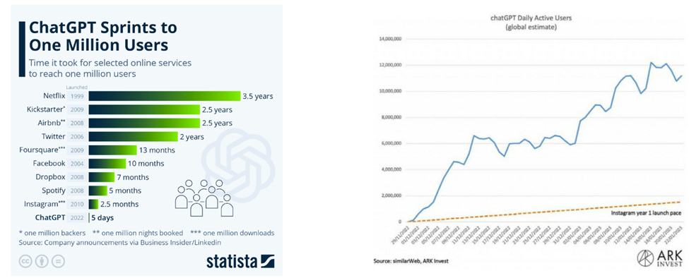
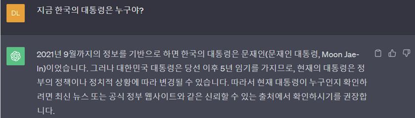
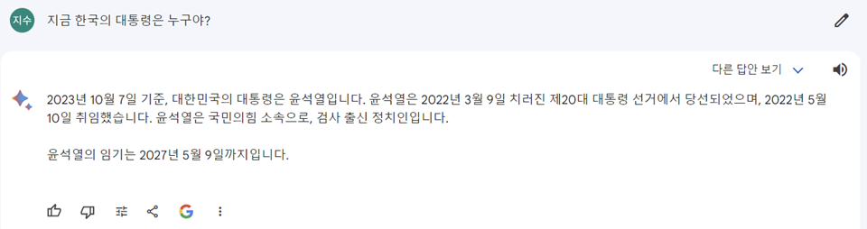
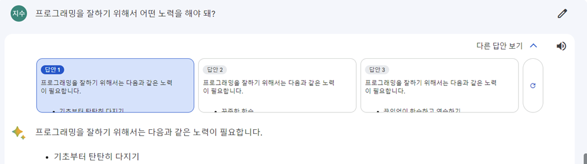
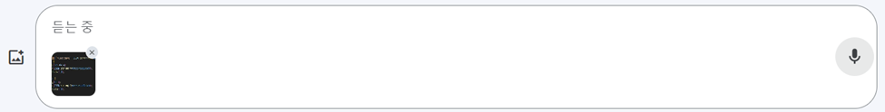

>요약 – OpenAI의 대화형 인공지능 ChatGPT는 출시 5일 만에 사용자가 100만 명을 넘어섰다. 이에 대항하여 구글은 Bard를 출시했으며 본 Survey 보고서는 두 서비스의 차이점에 대해 기술하고 있다. ChatGPT는 GPT-3.5를, Bard는 구글의 람다(LaMDA) 모델을 기반으로 하고 있으며 최신 정보 제공 여부, 답변의 다양성, 공유 및 이미지 업로드 기능의 유무에서 차이를 보인다. 이러한 차이로 인해 사용 목적에 따라 적합한 서비스가 다르며 향후 우리 일상생활에서의 대화형 인공지능 활용도는 높아질 것이다.

## 서론
대화형 인공지능 ChatGPT는 2022년 11월 30일 발표된 이후 고도의 성능으로 큰 주목을 받았다. 출시 두 달 만에 월간 액티브 유저가 1억 명에 도달하며 사상 가장 빠른 속도로 성장했다. 서비스 사용자가 100만이 되기까지 걸린 시간은 단 5일이며 인스타그램과는 비교도 안 될 정도로 빠르게 사용자가 늘고 있다.

<small style="color: gray;">[그림1] (왼) 유명 서비스 사용자 100만 명 돌파하는데 걸린 시간 (오) 같은 기간 동안 ChatGPT와 인스타그램 사용자 수 (출처: Statistia, similarWeb, ARK Invest)</small>

ChatGPT가 선풍적인 인기를 끌자 구글 검색의 위기론이 지속적으로 제기되어 왔다. ChatGPT가 장기적으로 구글 검색 엔진을 대체할 수 있다는 가능성 때문이다. 이에 따라 구글은 심각한 위기 경고를 뜻하는 ‘코드레드’를 사내에 발령했다.

구글은 지난 3월 OpenAI의 ChatGPT에 맞설 대항마로 Bard를 출시했다. 구글 모회사인 알파벳의 순다르 피차이 최고경영자는 공식 홈페이지를 통해 “Bard를 일부 테스터에게 먼저 공개한 후 수주일 안에 일반 대중에게 선보이겠다”고 밝히고 향후 Bard를 구글 검색 엔진에도 탑재하겠다고 선언했다. 이에 따라 OpenAI에 100억 달러 투자 계획을 밝힌 마이크로소프트와의 대격전이 예상된다. 두 대화형 인공지능의 차이점은 무엇일까?

## 본론
ChatGPT는 OpenAI에서 개발한 자연어 처리(NLP) 기반의 인공지능 모델이다. GPT-3.5 아키텍처를 기반으로 하며, 대화형 AI 시스템을 구축하고 다양한 자연어 처리 작업을 수행하는 데 사용된다. 이 모델은 대화 형식의 입력을 이해하고 적절한 응답을 생성할 수 있으며 일반적인 질문에 대한 답변, 텍스트 생성 및 요약, 언어 번역 등이 가능하다.

Bard는 구글의 대규모 언어 모델 ‘람다(LaMDA)’를 기반으로 하고 있으며 람다는 2021년 처음 공개된 이후로 계속 업데이트가 진행되고 있다. 

  
| | ChatGPT | Bard |
|:---:|:---:|:---:|
| 제조사 | OpenAI | Google |
| 기반 모델 | GPT series | LaMDA |
| 가격 | GPT-3.5 무료 / GPT-4.0 20달러 | 무료 |
| 출시 시기 | 2022년 11월 | 2023년 3월 |
| 인터넷 접근 | 불가능 | 가능 |
| 응답 표출 | 하나의 질문에 하나의 응답을 표출 | 하나의 질문에 다양한 응답을 표출 |
| 향후 추세 | 급속한 성장 이후 성숙 단계로 나아가 사용자 피드백을 기반으로 품질 개선 | 구글의 검색 엔진 향상 및 타 서비스와의 차별점 확보 |
  

<small style="color: gray;">[표1] ChatGPT와 Bard의 특징</small>

프롬프트에 질문이나 요청 내용을 입력하면 텍스트 기반의 답변을 생성한다는 점에서 겉보기에는 ChatGPT와 큰 차이가 없어 보인다. 하지만 ChatGPT와 Bard는 성능과 편의성 측면에서 다음과 같은 차이점이 있다.

첫째, 최신 정보 제공 유무이다. ChatGPT는 2021년 9월까지 수집된 데이터를 기반으로 답변하는 반면 Bard는 인터넷 상에서 정보를 가져올 수 있기 때문에 최신 정보를 제공한다. 하나의 예시를 들어보면, 지금 한국의 대통령은 누구냐는 질문에 ChatGPT는 “2021년 9월까지의 정보를 기반으로 하면 한국의 대통령은 문재인이었습니다.”라고 답변했고 Bard는 “2023년 10월 7일 기준, 대한민국의 대통령은 윤석열입니다.”라고 답변했다. 

<small style="color: gray;">[그림2-1] “지금 한국의 대통령은 누구야?”라는 질문에 대한 ChatGPT의 답변</small>

<small style="color: gray;">[그림2-2] “지금 한국의 대통령은 누구야?”라는 질문에 대한 Bard의 답변</small>

둘째, 답변의 다양성이다. ChatGPT는 일단 하나의 답변을 생성한 후 네트워크 에러가 생기거나 사용자가 ‘Regenerate’ 버튼을 누르면 다른 답변을 생성한다. 그러나 Bard는 프롬프트(질문 또는 요청)를 주면 사용자가 따로 조작을 하지 않아도 반드시 세 가지의 답변을 생성한다. 다만 세 답변이 크게 다르지 않다는 아쉬움이 있다.

<small style="color: gray;">[그림3] 세 가지 답안을 제공하는 Bard</small>

셋째, 공유 기능의 유무이다. ChatGPT의 경우 코드를 생성하는 것까지는 해주지만 직접 실행을 하려면 별도의 개발 환경을 필요로 한다. 반면 Bard는 코드를 생성하고 ‘Colab으로 내보내기’를 클릭하면 생성한 코드를 Colab에서 바로 실행할 수 있다. 이외에도 이미지 업로드가 가능하고 마이크 기능을 사용할 수 있다는 점에서 사용자에게 더 높은 편의성을 제공한다.

<small style="color: gray;">[그림4-1] ‘Colab으로 내보내기’ 기능을 제공하는 Bard</small>

<small style="color: gray;">[그림4-2] 이미지 업로드, 마이크 기능을 제공하는 Bard</small>

ChatGPT와 Bard의 성능과 편의를 정리해보면 아래 표와 같다.

| | ChatGPT | Bard |
|:---:|:---:|:---:|
| 최신 정보 제공 | X | O |
| 답변 다양성 | 비교적 낮음 | 여러 개의 답변을 제공하나 서로 내용이 비슷함 |
| 공유 기능 | X | O |
| 이미지 업로드 | 불가능 | 가능 |
| 마이크 기능 | X | O |

<small style="color: gray;">[표2] ChatGPT와 Bard의 성능, 편의 비교</small>

## 결론
ChatGPT는 출시 2개월 만에 월간 액티브 유저 1억명을 돌파하는 신기록을 세우며 유례없는 인기를 끌었다. 사용자가 간단하게 질문을 입력하면 전문적 공학 지식부터 코딩 작업, 번역, 작문 등에 이르기까지 다양한 영역에 대해 상세한 답변을 해준다. ChatGPT는 압도적인 성능을 자랑하며 세계적인 챗봇 열풍을 불러일으켰지만 최근에는 방문자 증가세가 점차 둔화되고 있다. 2021년 9월까지 학습된 데이터만을 가지고 답변을 하기 때문에 오류를 자주 일으키고 최신 정보를 제공하지 않는다는 지적이 있다. 반면 Bard는 구글의 검색 엔진을 통해 최신 정보에 대한 비교적 높은 정확성을 보여준다. 초기 Bard의 경우 이전 대화 내용을 기억하지 않고 영어만 지원한다는 점에서 ChatGPT에 비해 경쟁력이 떨어졌으나, 현재는 ChatGPT처럼 방을 생성하여 새로운 대화를 시작하고 이전 대화를 기억할 수 있으며 40여개 언어를 지원하고 있다. 아직 ChatGPT에 비해 인지도가 많이 떨어지지만 향후 높은 성장세를 보일 것으로 기대된다.

ChatGPT와 Bard 중 어떤 것이 더 나은지에 대한 판단은 사용 목적에 따라 다르다. ChatGPT는 방대한 지식을 기반으로 자세하고 포괄적인 정보를 얻고자 할 때 적합하고 Bard는 자연스러운 개방형 대화 능력과 최신 정보를 필요로 할 때 유용할 것이다. 개인정보 유출, 표절, 정보의 신뢰성 문제가 개선된다면 우리 일상생활에서 ChatGPT, Bard와 같은 대화형 인공지능의 활용도는 더 높아질 것으로 전망된다.

## 참고문헌
[1] 신제인, “챗GPT, 국민 3명 중 1명 써봤다..."신뢰도 상당" 50·60대 호평”, 디지털데일리, 2023.03.20., <https://ddaily.co.kr/page/view/2023032010170949815>

[2] Arianna Johnson, “Bard Vs. ChatGPT: The Major Difference Between The AI Chat Tools, Explained”, Forbes, 2023.03.21., <https://www.forbes.com/sites/ariannajohnson/2023/03/21/bard-vs-chatgpt-the-major-difference-between-the-ai-chat-tools-explained/?sh=4b2e23c4684a>
